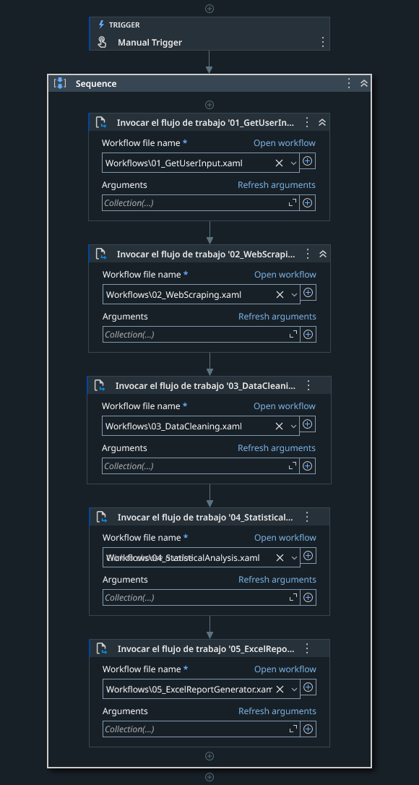
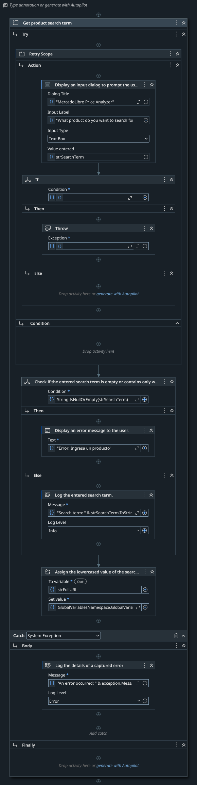
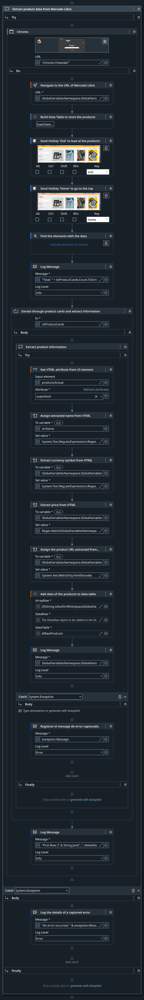
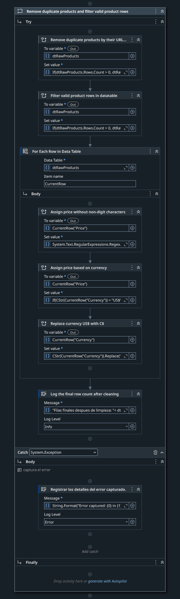
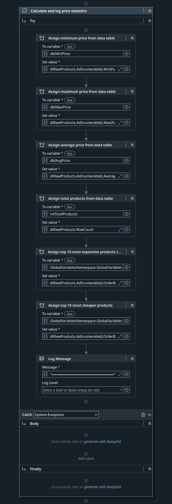

# MLNic_SmartPriceAnalyzer

## Description

MLNic_SmartPriceAnalyzer is an RPA (Robotic Process Automation) solution developed in UiPath Studio for extracting, processing, and analyzing product prices from MercadoLibre Nicaragua. The bot automates the complete workflow of market research, from data collection to statistical report generation in Excel.

This project demonstrates implementation of web scraping techniques, data cleaning processes, statistical analysis, and automated report generation with dynamic charts.

---

## Table of Contents

1. [Features](#features)
    
2. [Project Architecture](#project-architecture)
    
3. [Workflow Details](#workflow-details)
    
4. [Technical Requirements](#technical-requirements)
    
5. [Installation](#installation)
    
6. [Configuration](#configuration)
    
7. [Usage](#usage)
    
---

## Features

- User input validation with retry mechanism for search term entry
    
- Automated web scraping from MercadoLibre Nicaragua using Chrome browser
    
- Dynamic page loading handling with keyboard hotkeys
    
- Data cleaning including duplicate removal and price normalization
    
- Multi-currency support (USD to Cordobas conversion)
    
- Statistical calculations: minimum, maximum, average prices, and product rankings
    
- Excel report generation with clustered column charts
    
- Comprehensive error handling with Try-Catch blocks throughout all workflows
    
- Modular architecture with separated workflow files
---

## Project Architecture

The solution follows a modular design pattern with five independent workflow files orchestrated by a main process:

```text
MLNic_SmartPriceAnalyzer/
 │ 
 ├── Main.xaml 
 │ ├── Workflows/ 
 │   ├── 01_GetUserInput.xaml 
 │   ├── 02_WebScraping.xaml 
 │   ├── 03_DataCleaning.xaml 
 │   ├── 04_StatisticalAnalysis.xaml 
 │   └── 05_ExcelReportGenerator.xaml 
 │ ├── Data/ 
 │   └── Output/ 
 │      └── ProductAnalysis.xlsx
 │ └── project.json
``` 

---

## Workflow Details

## Main.xaml

The main orchestrator workflow that executes all sub-workflows in sequential order using a Manual Trigger



| Execution Order | Workflow                     | Purpose                               |
| --------------- | ---------------------------- | ------------------------------------- |
| 1               | 01_GetUserInput.xaml         | Capture and validate user search term |
| 2               | 02_WebScraping.xaml          | Extract product data from website     |
| 3               | 03_DataCleaning.xaml         | Clean and normalize extracted data    |
| 4               | 04_StatisticalAnalysis.xaml  | Calculate price statistics            |
| 5               | 05_ExcelReportGenerator.xaml | Generate Excel report with charts     |

---

## 01_GetUserInput.xaml

Handles user input collection with validation and retry logic. 



**Process Flow:**

1. Display Input Dialog with title "MercadoLibre Price Analyzer"
    
2. Prompt user: "What product do you want to search for?"
    
3. Store response in `strSearchTerm` variable
    
4. Validate input using `String.IsNullOrEmpty(strSearchTerm)`
    
5. If empty: Display error message and throw exception to trigger retry
    
6. If valid: Log search term and construct full URL
    

**Key Components:**

- Retry Scope for input validation retry mechanism
    
- Input Dialog with Text Box input type
    
- Conditional validation with If activity
    
- Throw activity for empty input handling
    
- URL construction using GlobalVariablesNamespace
    

**Variables:**

|Variable|Type|Purpose|
|---|---|---|
|strSearchTerm|String|User entered product search term|
|strFullURL|String|Complete MercadoLibre search URL|

---

## 02_WebScraping.xaml

Performs web scraping operations on MercadoLibre Nicaragua.



**Process Flow:**

1. Open Chrome browser with new tab
    
2. Navigate to MercadoLibre search URL from GlobalVariables
    
3. Build Data Table structure to store extracted products
    
4. Send Hotkey "End" to trigger lazy loading of all products
    
5. Send Hotkey "Home" to return to page top
    
6. Find UI elements containing product data
    
7. Log element count found
    
8. Iterate through product cards and extract data fields
    

**Key Components:**

- Use Application/Browser activity with Chrome
    
- Navigate To activity for URL navigation
    
- Build Data Table for structured data storage
    
- Send Hotkey activities for page manipulation
    
- For Each UI Element for data extraction iteration
    

**Data Table Structure:**

|Column|Description|
|---|---|
|ProductName|Name/title of the product|
|Price|Raw price string with currency symbol|
|Currency|Currency type (C$ or US$)|
|URL|Product listing URL|

---

## 03_DataCleaning.xaml

Cleans and normalizes the raw extracted data.



**Process Flow:**

1. Remove duplicate products by their URL field
    
2. Filter valid product rows (non-empty required fields)
    
3. For Each Row in Data Table:
    
    - Assign price without non-digit characters (regex cleaning)
        
    - Assign price based on currency conversion
        
    - Replace currency symbol US$ with C$
        
4. Log final row count after cleaning process
    

**Key Components:**

- Assign activities with LINQ expressions for duplicate removal
    
- Conditional filtering: `If(dtRawProducts.Rows.Count > 0, dtRaw...)`
    
- For Each Row in Data Table with CurrentRow iterator
    
- Regex operations for price string cleaning
    
- Currency conversion calculations
    

**Data Transformations:**

|Operation|Description|
|---|---|
|Duplicate Removal|Remove entries with same product URL|
|Row Validation|Filter rows with valid price and name data|
|Price Cleaning|Remove non-numeric characters from price strings|
|Currency Standardization|Convert all prices to local currency (Cordobas)|

---

## 04_StatisticalAnalysis.xaml

Calculates statistical metrics from cleaned product data.




**Process Flow:**

1. Assign minimum price using LINQ Min() function
    
2. Assign maximum price using LINQ Max() function
    
3. Assign average price using LINQ Average() function
    
4. Assign total products count using RowCount property
    
5. Assign top 10 most expensive products using OrderByDescending
    
6. Assign top 10 cheapest products using OrderBy
    
7. Log calculated statistics
    

**Key Components:**

- LINQ AsEnumerable() methods for DataTable operations
    
- Statistical functions: Min(), Max(), Average()
    
- OrderBy/OrderByDescending for ranking calculations
    
- Take(10) for top N selection
    

**Output Variables:**

|Variable|Type|Description|
|---|---|---|
|dblMinPrice|Double|Lowest price found|
|dblMaxPrice|Double|Highest price found|
|dblAvgPrice|Double|Average price of all products|
|intTotalProducts|Int32|Total number of valid products|
|dtTop10Expensive|DataTable|Top 10 highest priced products|
|dtTop10Cheaper|DataTable|Top 10 lowest priced products|


## 05_ExcelReportGenerator.xaml

Generates the final Excel report with data and visualizations.


**Process Flow:**

1. Excel Process Scope initialization
    
2. Assign Excel file path from GlobalVariables
    
3. Use Excel File with "Create if not exists" option enabled
    
4. Write expensive products data to Excel sheet
    
5. Write cheaper products data to Excel sheet
    
6. Assign formatting configurations
    
7. Log report generation status
    
8. Insert Clustered Column Chart for cheaper products
    
9. Insert Clustered Column Chart for expensive products
    

**Key Components:**

- Excel Process Scope for application handling
    
- Use Excel File with Save changes and Create if not exists options
    
- Write DataTable activities for data export
    
- Insert Chart activities with Column category and Clustered Column type
    

**Excel Output Structure:**

|Sheet|Content|
|---|---|
|Expensive Products|Top 10 most expensive products with details|
|Cheaper Products|Top 10 cheapest products with details|
|Charts|Visual representations of price distributions|

**Chart Configuration:**

|Property|Value|
|---|---|
|Chart Category|Column|
|Chart Type|Clustered Column|
|Data Range|Dynamic based on DataTable|

---

## Technical Requirements

## Software Requirements

|Component|Version|Notes|
|---|---|---|
|UiPath Studio|2023.x or higher|Community or Enterprise edition|
|Microsoft Excel|2016 or higher|Required for report generation|
|Google Chrome|Latest stable|Primary browser for web scraping|
|UiPath Chrome Extension|Latest|Must be installed and enabled|
|.NET Framework|4.6.1+|Required by UiPath runtime|

## System Requirements

- Windows 10/11 (64-bit)
    
- Minimum 8 GB RAM (16 GB recommended)
    
- Stable internet connection
    
- Screen resolution: 1920x1080 or higher recommended
    

## UiPath Dependencies

- UiPath.System.Activities
    
- UiPath.UIAutomation.Activities
    
- UiPath.Excel.Activities
    
- UiPath.WebAPI.Activities
    

---

## Installation

1. Clone or download the repository:
    

```bash
git clone https://github.com/Wesleykyle2005/MLNic_SmartPriceAnalyzer.git
```

2. Open UiPath Studio
    
3. Select "Open Project" from the start menu
    
4. Navigate to the project folder and select `project.json`
    
5. Wait for dependency restoration to complete
    
6. Verify Chrome extension is installed:
    
    - Open Chrome browser
        
    - Navigate to `chrome://extensions`
        
    - Confirm UiPath Web Automation extension is enabled
        

---

## Usage

## Running the Bot

1. Open the project in UiPath Studio
    
2. Ensure Chrome browser is closed
    
3. Click "Run" or press F5
    
4. Enter the product search term when prompted
    
5. Wait for execution to complete
    
6. Find the generated report in the Output folder
    

## Input Requirements

- Search term must not be empty
    
- Search term should be a valid product category or name
    
- Examples: "laptops", "celulares", "televisores"
    

---


## Report Contents

The Excel report includes:

    
1. **Top 10 Expensive**: Detailed list of highest priced products
    
2. **Top 10 Cheaper**: Detailed list of lowest priced products
    
3. **Price Distribution Chart**: Clustered column visualization of expensive products
    
4. **Budget Options Chart**: Clustered column visualization of cheaper products
    